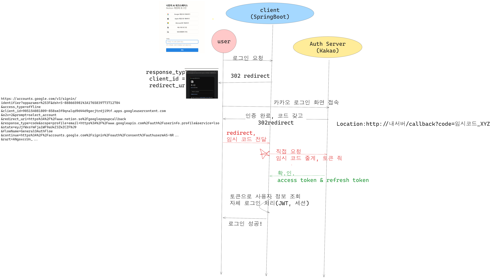

# OAuth

OAuth 2.0 Authorization

```
     +--------+                               +---------------+
     |        |--(A)- Authorization Request ->|   Resource    |
     |        |                               |     Owner     |
     |        |<-(B)-- Authorization Grant ---|               |
     |        |                               +---------------+
     |        |
     |        |                               +---------------+
     |        |--(C)-- Authorization Grant -->| Authorization |
     | Client |                               |     Server    |
     |        |<-(D)----- Access Token -------|               |
     |        |                               +---------------+
     |        |
     |        |                               +---------------+
     |        |--(E)----- Access Token ------>|    Resource   |
     |        |                               |     Server    |
     |        |<-(F)--- Protected Resource ---|               |
     +--------+                               +---------------+
```

1. Client 
    - 웹사이트, 애플리케이션

2. Resource Owner(리소스 소유자)
    - 사용자, 실제 데이터 주인
    - 자신의 데이터에 접근권한을 줄지 말지 결정합니다.

3. Authorization Server(인증 서버)
    - ID, PW를 확인하고 권한을 부여해주는 서버입니다. (토큰 발급)
    - kakao, google, 내 Spring Security

4. Resource Server(리소스 서버)
    - 사용자가 원하는 데이터를 가지고 있는 서버
    - access token이 유효한지 확인, 데이터 내어줌.
    - google api, 내 Spring의 상품 목록 
    

### OAuth2 흐름

사용자가 Authorization Server에서 권한을 허용하면,
클라이언트는 Authorization Grant를 받아 Authorization Server에 전달하고,
Authorization Server는 이를 검증한 뒤 Access Token(및 Refresh Token)을 발급한다.
클라이언트는 Access Token으로 Resource Server에 접근하며,
Resource Server는 매 요청마다 토큰의 유효성을 검증한다.

### 추가 공부 사항

요약: 더 공부해야 할 우선순위
1. Authorization Code Grant 흐름: "Code를 받고 -> Token으로 교환"하는 과정을 구체적으로 이해하기. (스프링 시큐리티가 내부적으로 하는 일)
2. Refresh Token 전략: Access Token이 만료되었을 때 어떻게 갱신(Rotate)할 것인가?
3. Scope(범위) 설정: 사용자에게 최소한의 권한만 요구하는 방법.

## Authorization Code Grant



사용자가 Authorization Server로부터 로그인을 마치면, code라는 파라미터를 URL뒤에 붙여서 서버로 돌려보낸다. (임시 확인증) 
> URL로 전송해도 괜찮은 이유는, 이를 access token으로 바꾸기 위해서는 Client Secret이 필요한데, 이는 백엔드에 안전하게 저장되어있음. Authorization server에서 임시 토큰을 실제토큰으로 변경하기 위해서는 서버 정보도 필요하기 때문.

**Back Channel** : 임시 코드 + client secret -> 토큰으로 바꿈. 

## Scope
최소한으로 요구. 
